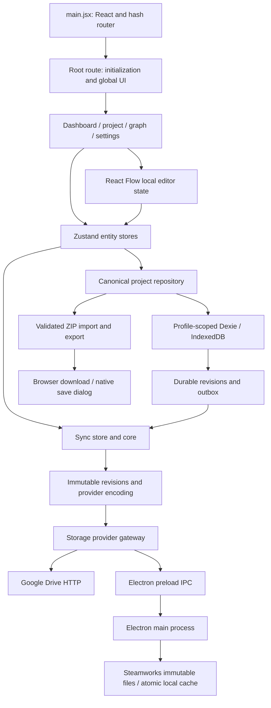

# Architecture and runtime flows

See [index](README.md), [domain model](domain-model.md), and [current source map](source-map-current.md). Historical findings remain in the issue register; current verification is recorded in [implementation progress](implementation-progress.md).

## Application boundary

Mountea Dialoguer is a React 18 application built by Vite. It has no application backend in this repository. Dialogue authoring data lives in IndexedDB on the current device. Optional Google Drive and Steam synchronization transport immutable revisions containing canonical whole-project snapshots and ancestry. Google payloads retain passphrase encryption; new Steam records rely on Steam account/cloud access controls. Versioned ZIP backups carry the same authoring representation through a separate transport adapter. There is no live collaborative editing protocol, server-side graph execution, or engine integration runtime here.

The renderer uses ES modules and JSX. Electron's main, preload, Steam, and Sentry modules use CommonJS. Package scripts, not a separate desktop renderer, select the Steam distribution. `runtimeConfig.getDistributionChannel()` defaults to `desktop` even in a browser; runtime detection separately checks `window.electronAPI.isElectron`. Do not equate a channel name with Electron capability.



## Startup sequence

1. [main.jsx](../../src/main.jsx) initializes i18next/CSS and renderer Sentry, constructs TanStack Router with `createHashHistory`, and renders `AppErrorBoundary` around `RouterProvider` in React StrictMode.
2. [Vite configuration](../../vite.config.js) discovers files below `src/routes` and generates `src/routeTree.gen.ts`. The generated tree is ignored by Git. Route components are split automatically.
3. [RootComponent](../../src/routes/__root.jsx) resolves Steam status/profile, resets entity stores, awaits the profile repository, rehydrates UI and sync preferences from that profile's defaults, and loads its account. Request tickets and repository generation checks reject late initialization responses. Initialization failures display an error instead of exposing authoring routes over an unready database.
4. The root installs activity tracking, device override handling, keyboard/native menu dispatch, rich presence, global dialogs, theme, notifications, and automatic synchronization. Cloud login prompting is coordinated with onboarding and provider/channel availability.
5. Page components load their own entities. The graph page additionally loads/materializes nodes, restores its viewport, and creates the fixed start node if needed. React StrictMode means initialization effects must tolerate repeated development execution.

Profile changes repeat initialization and abort old repository contexts. Operations capture `{db, profileId, generation, signal, assertCurrent}` before asynchronous work; keeping the database proxy alone is insufficient. Historical schemas migrate by validated copy into a separate database generation. A manifest activates the completed copy, while the original database and unresolved recovery evidence remain available.

## State ownership

| Owner | What it owns | Persistence |
| --- | --- | --- |
| Entity Zustand stores | Loaded collections, current project/dialogue, loading/error state, entity operations | Captured repository reads and transactional project mutations |
| Graph route and editor draft reducer | Editable React Flow nodes/edges, selected item, isolated history, viewport, draft revision and dirty state, preview state | Explicit graph save; not a live autosave hook |
| `uiStore` | View/sort/sidebar preferences and content locale by project | Profile-scoped localStorage |
| `syncStore` | Provider selection, status, retry scheduling/progress, account orchestration | Preferences in profile localStorage; revisions/outbox/conflicts in Dexie; browser secrets in memory or native secrets in the OS-protected vault |
| `steamStore` | Runtime status and last rich presence | Memory; bridge controls native state |
| Command/settings stores | Open state and context for global command UI | Memory |
| Components | Form drafts, expanded rows, media objects, dialog visibility | Usually memory until submit |
| Theme/i18next/tour tracking | Presentation/session preferences | Separate localStorage keys |

Most store load operations replace their collection with one project's rows. They are not normalized caches for all projects. `loadDialogues()` without a project loads all dialogues; the same method with a project narrows the shared array. Async page transitions can therefore affect another consumer's view of that collection. `currentProject` and `currentDialogue` are not automatically updated by every list refresh.

## Mutation and error conventions

The authoring path captures a repository context, validates a draft transformation, prepares its canonical snapshot, and commits authored records, project sequence, immutable revision and sync intent in one transaction. `mutateProject` serializes local project changes and uses browser locks across tabs; prepared commits reject a changed destination sequence. A scheduling notification can accelerate delivery, but persistence of the outbox does not depend on being connected or idle.

Import separates parsing, validation, preparation and commit. Parsing and media conversion perform no writes. Copy allocates identities and remaps references in two passes; explicit replacement identifies its destination and replaces obsolete graph content atomically. Failures reject with structured codes and record paths, and UI callers keep the failure visible. Domain constraints remain application-enforced rather than IndexedDB foreign keys; canonical validation and ownership checks apply at repository boundaries. Draft commits permit documented incomplete authoring states; export and remote application require strict validation. Do not bypass these boundaries with direct authoring-table writes.

## Author, save, export, sync

```mermaid
sequenceDiagram
  participant User
  participant Editor
  participant Store as dialogueStore
  participant Repository as Project repository
  participant DB as IndexedDB
  participant Sync as syncStore
  User->>Editor: Edit node / row / edge
  Editor->>Editor: Update draft, history, dirty flag
  User->>Editor: Save or export
  Editor->>Store: saveDialogueGraph(activeLocale)
  Store->>Store: Build localized entries; validate; serialize audio
  Store->>Repository: Prepare canonical project at captured sequence
  Repository->>DB: Atomic authoring + revision + outbox commit
  Store->>Sync: schedulePush(projectId)
  Store-->>Editor: Resolve or throw
  opt Export requested
    Editor->>Store: exportDialogue(dialogueId)
    Store->>Repository: Consistent project read and strict validation
    Store-->>User: ZIP via download / native save dialog
  end
  opt Connected provider and scheduling permitted
    Sync->>DB: Read durable pending revisions
    Sync->>Sync: Encode, publish immutable files, verify exact revision
    Sync->>DB: Record provider-specific acknowledgement
  end
```

Successful local save does not imply cloud upload or remote verification. Snapshots read all authoring tables and project state consistently. A save acknowledgement for draft revision N cannot clear dirty state for later edits. Media is normalized to durable bytes/base64 before serialization; playback owners allocate and release object URLs.

Sync compares revision ancestry, retaining divergent heads as conflicts rather than overwriting one. Explicit resolution acknowledges both parents and preserves history. Deletions are revisions, not inferred from missing catalog entries. List mode performs no writes; pull prohibits publication; upload-capable modes drain durable intent with bounded retry. Legacy cloud objects remain read-only and old clients use a different namespace. See [synchronization](synchronization.md) for delivery states, conflict choices and recovery behavior.

## Change boundaries

Adding a node type touches configuration, node rendering, editor registration/creation, preview semantics, localization, archive compatibility, and possibly engine consumers outside this repository. Adding a persisted field requires considering snapshots, ZIP serialization, local-only stripping, import normalization, clone remapping, and tests. Adding a provider touches both the registry and adapter map plus account/passphrase UI and sync orchestration; implementing the six storage methods alone is insufficient.

The largest concentration of responsibilities is the graph route, followed by `electron/main.cjs`, `dialogueStore`, `syncStore`, and `projectStore`. Their callback/function boundaries are indexed in the [current callable index](logic-index-current.md). Circular store imports exist, especially project/dialogue/sync; avoid introducing eager side effects that depend on initialization order. Focused local regressions establish the replacement contracts; live-provider and platform release checks are separate acceptance gates, not implied by this architecture description.
