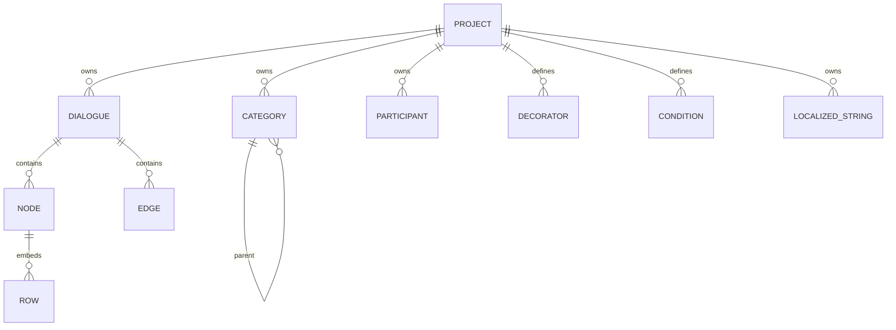

# Domain model and invariants

See [persistence](persistence.md) for physical keys, [editor](graph-editor.md) for authoring, and [archives](import-export.md) for wire formats. Canonical project validation enforces identities, ownership, references, domain schemas and localization; unknown JSON-compatible authored fields remain preserved. Field lists below describe the principal consumed conventions rather than an exhaustive closed schema.

## Ownership and identity



These relationships are conceptual, not DB-enforced foreign keys. IDs are normally UUID strings. `projects`, `dialogues`, categories, participants, decorators, and conditions have globally unique primary IDs **within a profile database**. Nodes and edges have compound `[dialogueId, id]` keys. A fixed start node ID is reused in every dialogue: `00000000-0000-0000-0000-000000000001`. Never query/delete a node by its bare ID.

| Record | Principal fields | Important semantics |
| --- | --- | --- |
| Project | `id`, `name`, `description`, `version`, `localization`, `createdAt`, `modifiedAt`, `isExample`, `importSource` | Owns reusable definitions and dialogues. `dialogueCount` is computed on load. `lastExportPath` and `syncTimestamp` are local bookkeeping. |
| Dialogue | `id`, `projectId`, `name`, `description`, timestamps, `viewport`, `localizationSlug`, `localizationVersion` | Stores metadata separately from graph. `nodeCount` is computed; `viewport` is `{x,y,zoom}`. Canonical backups preserve description and viewport. |
| Category | `id`, `projectId`, `name`, `parentCategoryId`, timestamps | Hierarchy exported as dot-separated `fullPath`; root parent is null/absent. |
| Participant | `id`, `projectId`, `name`, `categoryId`, `category`, `thumbnail`, timestamps | `categoryId` is stable identity; `category` is a display projection. Nodes and rows use `participantId` with legacy names retained for recovery. |
| Decorator definition | `id`, `projectId`, `name`, `type`, `properties[]`, timestamps | Property schema for node instances; arbitrary type is metadata for downstream consumers. |
| Condition definition | Same broad shape as decorator | Property schema for edge rules; editor preview simulates truth values. |
| Node | `id`, `dialogueId`, `type`, `position:{x,y}`, `data` | Data fields depend on type. React Flow can add transient selection/measurement fields. |
| Edge | `id`, `dialogueId`, `source`, `target`, handles, `type`, `markerEnd`, `data` | Conditions live in `data.conditions`; endpoints are node IDs in the same dialogue. |
| Row (embedded) | `id`, `textKey`, `localizationRowToken`, `duration`, `audioFile`, optionally `participant` | Ordered inside `node.data.dialogueRows`; materialized UI adds `text`. Default duration is 3 seconds. Preview speaker currently comes from the node. |
| Localized string | `projectId`, `key`, dialogue/node/row IDs and tokens, `field`, `values`, timestamps | Canonical localized text; `values` maps locale tags to strings. |

## Categories and participants

[categoryStore](../../src/stores/categoryStore.js) and shared [domain integrity](../../src/lib/domainIntegrity.js) enforce alphanumeric ASCII category names of at most 16 characters and a maximum of five levels. Names must be unique within a root tree; another root can reuse a leaf name. Tree helpers protect against revisiting an identity, including path building. Validation checks the resulting subtree, not only the moved category's depth.

[participantStore](../../src/stores/participantStore.js) enforces alphanumeric ASCII participant names of at most 16 characters, an owned category identity, and same-name uniqueness within its category root. It normalizes PNG thumbnails and caps each at 1 MiB. Provider payload limits are checked by transport; local authoring is not rejected merely because a whole project exceeds a cloud provider's payload budget. Participant archives use bounded extraction and export preflight.

Category mutation validates project ownership, cycles and the resulting depth of every descendant. Hierarchical imports reuse existing path prefixes and reject invalid batches atomically. Participant/category selectors use stable identities with readable full paths; legacy ambiguous names require explicit repair. Referenced categories, participants, definitions, child dialogues and return targets cannot be deleted until their references are removed or reassigned. Domain writes use the canonical repository commit and durable outbox.

## Definitions versus instances

A definition's `properties` are `{name, type, defaultValue}` records. The form offers string, number, and boolean values. Store create/update validates property names, supported types and typed defaults. Referenced definitions cannot lose or change existing property types; additive properties remain permitted. Property names index the instance `values` object, so duplicate property names overwrite one another conceptually.

```json
{
  "decorators": [{"id": "definition-id", "name": "GiveItem", "values": {"amount": 2}}],
  "conditions": {
    "mode": "all",
    "rules": [{"id": "condition-id", "name": "HasKey", "values": {"key": "gate"}, "negate": false}]
  }
}
```

The two example fields belong to different owners: decorators are in node data; conditions are in edge data. Definition edits do not rewrite all existing instances. Removing a referenced definition is blocked with reference locations. Panels resolve definitions by ID, so missing definitions prevent property-schema editing even when the instance remains serializable.

Condition defaults use `?? ''` and preserve false/zero. Decorator instantiation also preserves false/zero with nullish defaults (ISS-028). Decorators have no execution semantics in the preview; they are authored metadata.

## Identity rules for changes

1. Preserve dialogue scope on node/edge operations and the fixed start ID within that scope.
2. Use explicit copy or replacement import. Copy allocates identities; replacement names its destination and removes obsolete graph content. There is no implicit merge/reassignment of another project's records; see [import/export](import-export.md).
3. When generating IDs, remap category parents, dialogue ownership, return targets, child-dialogue targets, definition instances, edge rules, row/audio bindings, and localized keys/metadata together.
4. Keep display names separate from stable identity. A readable localization token is not a globally unique entity ID.
5. Do not assume a graph loaded directly from Dexie contains display text or playable blobs. Use localization materialization and audio restoration.

Canonical commits check existing global entity identities before replacing data. A foreign-owned dialogue/definition/participant/category identity rejects the transaction. Copy uses the complete identity map; normal remote snapshot application cannot take ownership of another project's records. These checks replace the original ISS-003 and ISS-014 behaviors, whose reproductions remain in the historical register.

## Recovery and verification

The root mounts RecoverySummary for every profile, including zero-project migrations and missing-owner diagnostics. Available owners open project settings; orphan/global records remain unresolved with downloadable original evidence and manual recovery guidance. Project settings mount ProjectRecoveryPanel with explicit replacement selectors and reviewed quarantined-node restoration. The root recovery summary also exposes diagnostics whose owner no longer exists, including when there are no projects. Downloads preserve binary evidence in tagged/base64 representations; the original recovery record remains unchanged. Restoration commits its node, recovery resolution, immutable revision and outbox together. Missing originals and orphan diagnostics are never silently dismissed. Profile-captured loads reject stale results.

Focused regressions live in `tests/e2e/domain-regressions.spec.js`, with migration fixtures in `persistence-regressions.spec.js`. They cover cycles/depth, protected references, mounted replacement selection, exact quarantined bytes, numeric historical identity repair, retained orphan evidence and injected outbox quota rollback. See the [implementation ledger](implementation-progress.md) for executed results and remaining acceptance gates; live-provider/native integration is separate.

